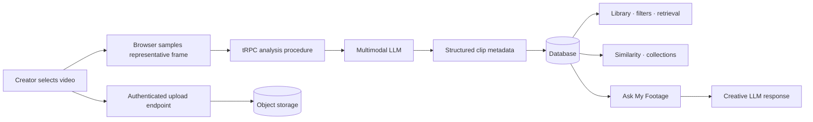

# Framefind

> **An AI-powered creative retrieval workspace for casual creators who have messy footage and do not yet know exactly what they want to make.**

Framefind is not a timeline editor or an automatic vlog generator. It helps creators understand what they have already filmed: discover clips through natural language, surface visually similar material, organize promising footage into collections, and ask grounded creative questions before editing begins.

## What is implemented

| Capability | Current implementation |
| --- | --- |
| Footage upload | Multiple-file browse and drag-and-drop input, client-side representative-frame sampling, progress UI, 50 MB prototype guardrail, and secure media persistence. |
| AI metadata | A representative frame is sent server-side to a multimodal model, which returns structured JSON for subject, setting, time, lighting, colors, mood, shot type, camera motion, and possible uses. |
| Footage library | Responsive grid view with durations, visual descriptions, mood / shot tags, selection controls, and metadata filters. |
| Natural-language retrieval | Metadata-backed matching for phrases such as `quiet blue night shots`, with per-card matching cues. |
| Find Similar | Ranked metadata similarity across color, lighting, mood, subject, composition, and camera motion. |
| Collections | Named manual collections plus automatically derived thematic suggestions from the available footage metadata. |
| Ask My Footage | Grounded creative guidance based only on the selected clips’ metadata. |

## Product architecture



The system stores video bytes in object storage and keeps only storage keys, URLs, metadata, and collection relationships in the database. Model credentials remain server-side; browser code never receives a model key.

## Local development

```bash
pnpm install
pnpm dev
```

Run the quality checks with:

```bash
pnpm check
pnpm test
```

The scaffold uses managed authentication, database, object storage, and server-side AI helpers. A local database connection and the platform-provided environment variables are therefore required for full upload and AI behavior.

## Repository map

| Path | Responsibility |
| --- | --- |
| `client/src/pages/Home.tsx` | Main Framefind workspace and interaction states. |
| `client/src/index.css` | Typography, dark visual system, surface treatments, and interaction motion. |
| `server/footage.ts` | Footage types, sample workspace data, retrieval ranking, similarity, and thematic grouping. |
| `server/routers.ts` | Typed procedures for retrieval, AI metadata analysis, collections, and creative guidance. |
| `server/_core/index.ts` | Secure binary video-upload endpoint alongside the typed API middleware. |
| `drizzle/schema.ts` | Persistent data model for clips, collections, and collection membership. |
| `docs/PRD.md` | Product requirements and MVP acceptance criteria. |
| `docs/COMPETITOR_SUMMARY.md` | Focused category context and differentiation thesis. |

## Privacy and prototype boundaries

Framefind’s metadata inference intentionally uses a **single representative frame** in this prototype. It does not claim that a mood or camera-motion label is an objective fact; these are searchable creative impressions that a user can evaluate. Uploading requires an authenticated workspace and only occurs after the creator explicitly selects files.

The present version is designed as a product prototype rather than a high-volume video-processing pipeline. It does not yet include background queues, transcription, multi-frame temporal analysis, embeddings/vector search, video deletion, collaborative workspaces, or editing-timeline export. These are natural directions for a subsequent production architecture.

## Product direction

The core product decision is to support exploration **before** storytelling. Rather than asking a creator to define a narrative at upload time, Framefind lets the narrative emerge from semantic retrieval, visual grouping, and creative reflection.

See the [PRD](docs/PRD.md) and [competitor summary](docs/COMPETITOR_SUMMARY.md) for the scoped product rationale.

## Contributing

Contributions are welcome. Please read [CONTRIBUTING.md](CONTRIBUTING.md) for the project’s product, privacy, quality, testing, and pull-request expectations.

## License

This project is available under the [MIT License](LICENSE).
