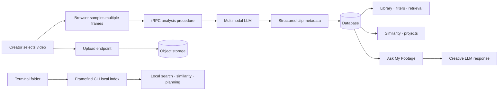

# Framefind

> **An AI-powered creative retrieval workspace for casual creators who have messy footage and do not yet know exactly what they want to make.**

Framefind is not a timeline editor or an automatic vlog generator. It helps creators understand what they have already filmed: discover clips through natural language, surface visually similar material, organize promising footage into editing projects, and ask grounded creative questions before editing begins.

## What is implemented

| Capability | Current implementation |
| --- | --- |
| Footage upload | Multiple-file browse and drag-and-drop input, client-side multi-frame sampling, progress UI, 50 MB prototype guardrail, and secure media persistence. |
| AI metadata | Several sampled frames are sent server-side to a multimodal model, which returns a single clip-level Metadata V2 structure for subject, setting, time, lighting, colors, mood, shot type, camera motion, and possible uses. |
| Private Workspace & projects | Personal uploads are organized into named editing projects (virtual folders) for separate trips, clients, and cuts; clips can remain loose or be moved between projects without relocating originals. |
| Sample Playground | A separate, public, read-only route with fictional clips, metadata, images, and sample project groupings. It never mixes with your uploaded footage. |
| Full clip preview & removal | A focused personal-clip panel with native playback, seekable progress control, project reassignment, and confirmation-based Workspace removal. |
| Natural-language retrieval | Metadata-backed matching for phrases such as `quiet blue night shots`, with per-card matching cues. |
| Find Similar | Ranked metadata similarity across color, lighting, mood, subject, composition, and camera motion. |
| Projects | Named manual editing projects plus automatically derived thematic project suggestions from the available footage metadata. Clips are members of any number of projects via loose membership. |
| Ask My Footage | Grounded creative guidance based only on the selected clips’ metadata. |
| Framefind CLI | Local folder scanning, portable JSON indexes, natural-language retrieval, similar-shot ranking, creative planning, and confirmation-gated copies into a new folder. |

## Product architecture



The system stores video bytes in object storage and keeps only storage keys, URLs, metadata, and project membership in the database. Model credentials remain server-side; browser code never receives a model key.

## Local development

```bash
pnpm install
pnpm dev
```

Run the quality checks with:

```bash
pnpm check
pnpm test
```

Framefind is a single-user local workspace. It uses the managed database, object storage, and server-side AI helpers. A local database connection and the platform-provided environment variables are therefore required for full upload and AI behavior. There is no login: every request binds to the persisted local workspace identity.

## Terminal workflow

Framefind also works from a terminal for local-first folder indexing and retrieval:

```bash
pnpm framefind index ~/Movies/tokyo-trip --index ~/Movies/tokyo-trip/framefind.index.json
pnpm framefind search "quiet blue night shots" --index ~/Movies/tokyo-trip/framefind.index.json
pnpm framefind similar "night/wide-street.mp4" --by color --index ~/Movies/tokyo-trip/framefind.index.json
pnpm framefind organize --index ~/Movies/tokyo-trip/framefind.index.json
```

The default CLI workflow is local and does not upload footage. `organize` asks what material to gather, previews every proposed destination, and requires the creator to type `COPY` before making duplicates. It never moves, renames, or deletes originals. Optional representative-frame AI analysis requires explicit `--confirm-ai`, an `ffmpeg` installation, and a configured compatible endpoint. Read the [CLI guide](docs/CLI.md) for all commands, privacy boundaries, and web/CLI differences.

## Repository map

| Path | Responsibility |
| --- | --- |
| `client/src/pages/` | Landing, private project Workspace (My Library), Sample Playground, Ask My Footage, and Documentation routes. |
| `client/src/index.css` | Sketchbook visual system, paper surfaces, annotations, and interaction motion. |
| `cli/framefind.mjs` | Terminal command entry point. |
| `cli/framefind-core.mjs` | Portable local-folder index, retrieval, similarity, and planning logic. |
| `server/footage.ts` | Footage types, sample workspace data, retrieval ranking, similarity, and thematic grouping. |
| `server/routers.ts` | Typed procedures for retrieval, AI metadata analysis, editing projects, and creative guidance. |
| `server/_core/index.ts` | Secure binary video-upload endpoint alongside the typed API middleware. |
| `drizzle/schema.ts` | Persistent data model for editing projects, clips, and project membership. |
| `docs/PRD.md` | Product requirements and MVP acceptance criteria. |
| `docs/COMPETITOR_SUMMARY.md` | Focused category context and differentiation thesis. |
| `docs/CLI.md` | Terminal commands, local-index behavior, optional AI analysis, and privacy boundaries. |

## Privacy and prototype boundaries

Framefind’s metadata inference samples **several frames** in the browser and produces a single clip-level analysis. It does not claim that a mood or camera-motion label is an objective fact; these are searchable creative impressions that a user can evaluate. Uploading only occurs after the creator explicitly selects files.

The present version is designed as a product prototype rather than a high-volume video-processing pipeline. It does not yet include background queues, transcription, temporally-aware motion analysis, embeddings/vector search, collaborative workspaces, or editing-timeline export. Removing a clip clears its Workspace database record and storage references; the managed storage helper does not expose physical object deletion. These are natural directions for a subsequent production architecture.

## Product direction

The core product decision is to support exploration **before** storytelling. Rather than asking a creator to define a narrative at upload time, Framefind lets the narrative emerge from metadata-driven retrieval, visual grouping, and creative reflection. Vector/embedding-based semantic retrieval is planned as a later milestone.

See the [PRD](docs/PRD.md) and [competitor summary](docs/COMPETITOR_SUMMARY.md) for the scoped product rationale.

## Contributing

Contributions are welcome. Please read [CONTRIBUTING.md](CONTRIBUTING.md) for the project’s product, privacy, quality, testing, and pull-request expectations.

## License

This project is available under the [MIT License](LICENSE).
